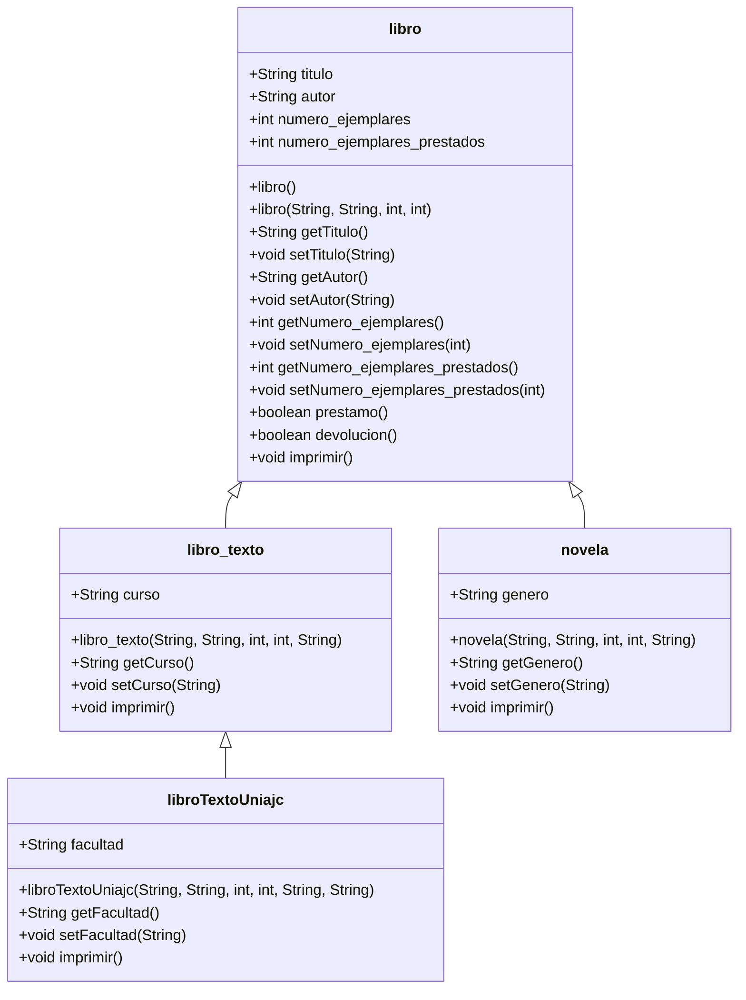

# Diagrama de clases (Mermaid)

```mermaid
classDiagram
    class libro {
        +String titulo
        +String autor
        +int numero_ejemplares
        +int numero_ejemplares_prestados
        +libro()
        +libro(String, String, int, int)
        +String getTitulo()
        +void setTitulo(String)
        +String getAutor()
        +void setAutor(String)
        +int getNumero_ejemplares()
        +void setNumero_ejemplares(int)
        +int getNumero_ejemplares_prestados()
        +void setNumero_ejemplares_prestados(int)
        +boolean prestamo()
        +boolean devolucion()
        +void imprimir()
    }

    class libro_texto {
        +String curso
        +libro_texto(String, String, int, int, String)
        +String getCurso()
        +void setCurso(String)
        +void imprimir()
    }

    class libroTextoUniajc {
        +String facultad
        +libroTextoUniajc(String, String, int, int, String, String)
        +String getFacultad()
        +void setFacultad(String)
        +void imprimir()
    }

    class novela {
        +String genero
        +novela(String, String, int, int, String)
        +String getGenero()
        +void setGenero(String)
        +void imprimir()
    }

    libro <|-- libro_texto
    libro_texto <|-- libroTextoUniajc
    libro <|-- novela
```
